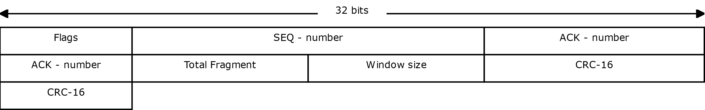
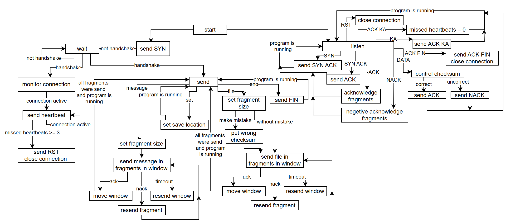
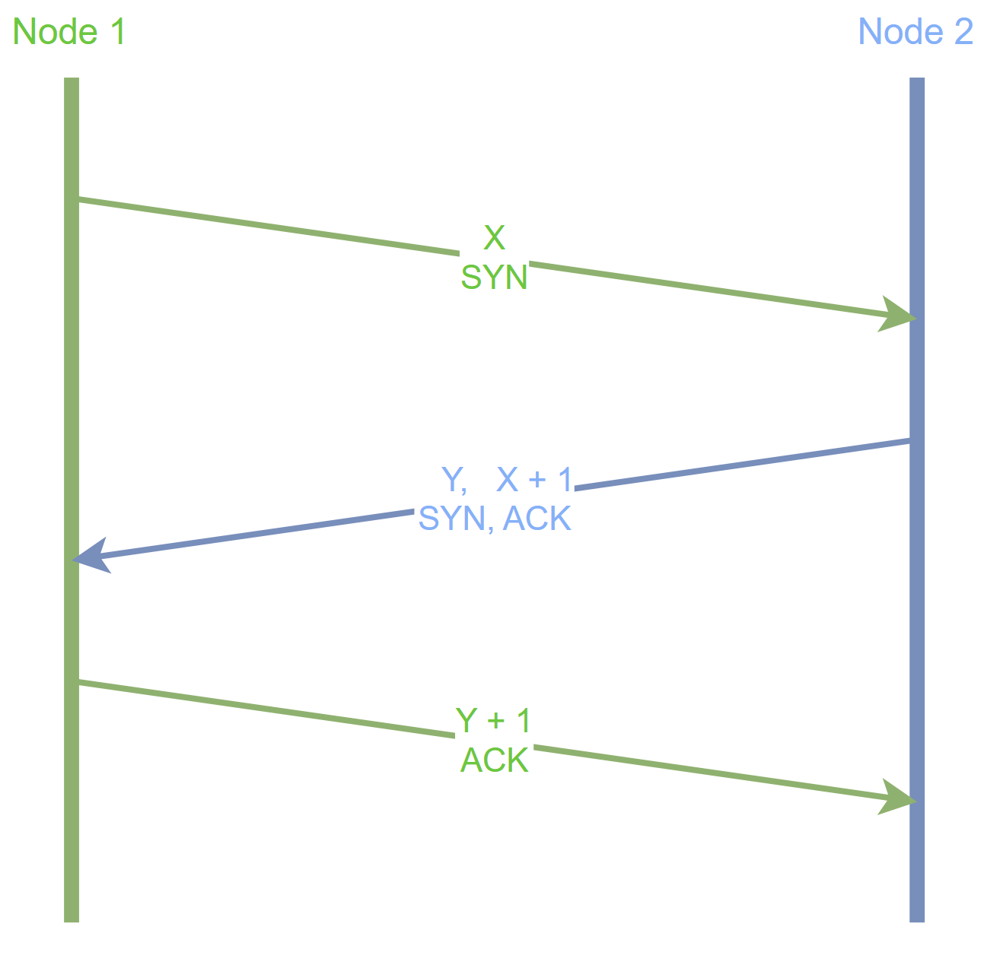
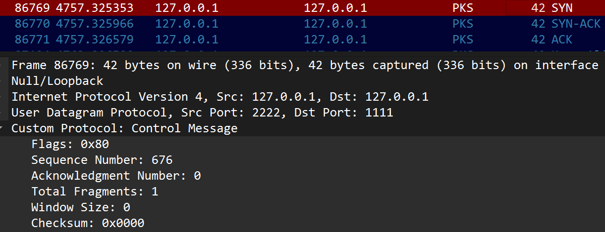
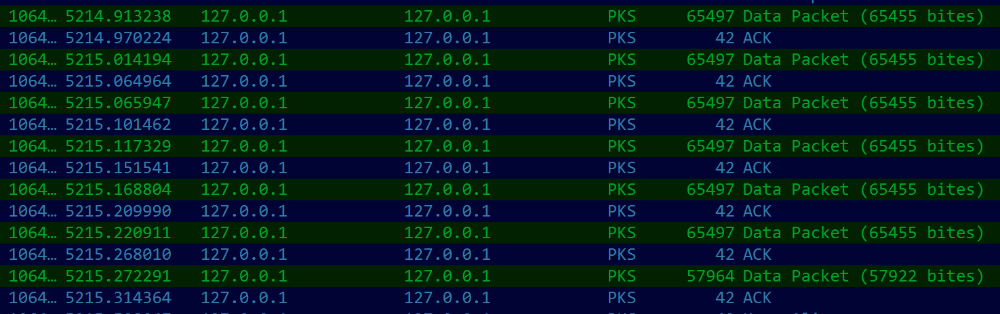
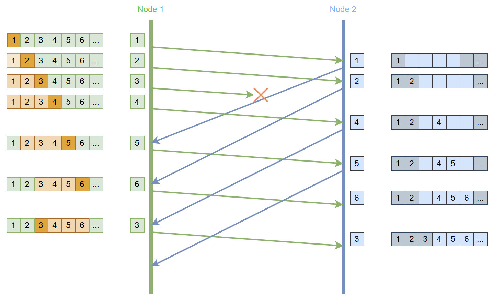
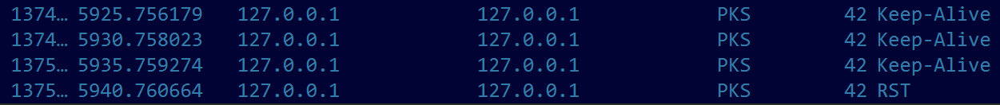
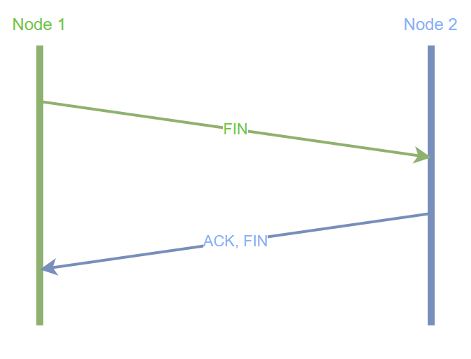
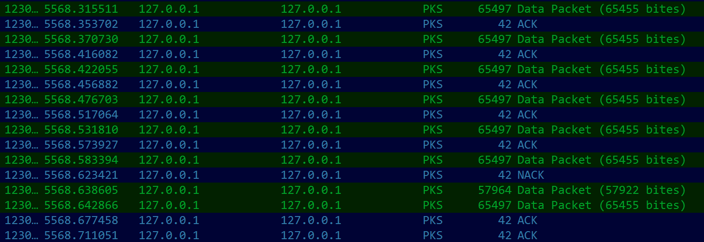

# Custom P2P Protocol over UDP


> A peer-to-peer communication protocol built from scratch on top of UDP, with its own header, handshake, fragmentation, integrity checking and retransmission, plus a Wireshark dissector for reading its traffic. Created as the semester project in the PKS course at FIIT STU

## Goal

UDP provides no connection, no ordering, no integrity guarantee and no delivery guarantee. The task was to design a protocol that adds all of it at the application layer, and to implement a P2P application on top of it in which two nodes act simultaneously as sender and receiver, exchanging both text messages and files over a local Ethernet network

Every mechanism below is therefore implemented manually: there is no library doing the reliability work, only `socket`, `struct` and `threading` from the standard library

## Protocol design



The header is 80 bits and is prepended to every datagram, control messages included

| Field | Size | Purpose |
|-------|------|---------|
| Flags | 8 b | Message type, one bit per flag, 7 used and 1 spare |
| Seq number | 16 b | Position of the fragment in the stream, used for ordering and reassembly |
| Ack number | 16 b | Sequence number being confirmed |
| Total fragments | 16 b | How many fragments the current transfer consists of |
| Window size | 8 b | How many fragments may be in flight before an acknowledgment |
| CRC-16 | 16 b | Checksum over the header and the payload |

| Flag | Value | Meaning |
|------|-------|---------|
| SYN | `0x80` | Connection request |
| ACK | `0x40` | Acknowledgment |
| NACK | `0x20` | Fragment arrived damaged, retransmit it |
| KA | `0x10` | Keep-alive |
| RST | `0x08` | Forced termination without confirmation |
| FIN | `0x04` | Graceful termination |
| DATA | `0x02` | Payload is a file, otherwise text |

Flags are combined, so the dissector resolves `0xC0` as SYN-ACK, `0x50` as ACK Keep-Alive and `0x44` as ACK-FIN

Two of these fields are there because of what implementation revealed. NACK was absent from the first version of the header and was added once ARQ was working: without an explicit negative acknowledgment a corrupted fragment is indistinguishable from a lost one, so an error the receiver has already detected still costs a full retransmission timeout instead of being reported immediately. Total fragments started at 8 bits, which a file split into small fragments exceeds easily, since 255 parts is only 255 kB at a 1 kB fragment size

## Structure of the program



Every key event is covered by the diagram: initialising the connection with IP and port, establishing it through the handshake, transferring data, maintaining the connection and terminating it

Each node runs three threads over one shared UDP socket, which is what makes both sides act as sender and receiver at the same time

| Thread | Responsibility |
|--------|----------------|
| Listener | Parses every incoming datagram, answers control messages, verifies checksums, stores fragments and pushes ACK/NACK into a queue |
| Monitor | Sends the heartbeat and counts missed responses, triggers reconnection or reset |
| Main | The user interface and the sending side of the sliding window |

## Implemented mechanisms

### Three-way handshake



The initiating node sends SYN with a random initial sequence number X. The second node answers SYN-ACK carrying its own random Y and the acknowledgment X + 1, and the first node closes the handshake with ACK Y + 1. Both sides have then agreed on each other's numbering and the connection counts as established. Data transfer is blocked until the handshake completes



The same exchange on the wire. The dissector decodes the SYN as flags `0x80` with the initial sequence number 676, which the SYN-ACK then acknowledges as 677

### Fragmentation

Before each transfer the user may set a fragment size or accept the maximum. The value is validated against the protocol limit and re-requested if it is too large or smaller than one byte. The file is split, the number of parts is written into the total fragments field, and the receiver reassembles the data only after every part has arrived, checking sequence numbers and integrity as it goes



A file sent at the maximum fragment size: full 65 455 B fragments, each answered by its own 42 B ACK, with the last fragment carrying the 57 922 B remainder

### Integrity verification

Each fragment carries a CRC-16 computed over the header and the payload with the Modbus polynomial `0xA001`. CRC was chosen over a hash because it is computed faster and costs less than MD5 or SHA for this purpose. CRC-8 is too short to catch the error patterns reliably and CRC-32 costs more than the project needs, so 16 bits is the balance

### Selective Repeat ARQ



Fragments are sent inside a sliding window of four. Each one is acknowledged separately, so a hole in the middle does not stall the rest: in the diagram fragment 3 is lost, fragments 4 to 6 are still delivered and acknowledged, and only fragment 3 is resent. A damaged fragment produces a NACK and is retransmitted immediately, an unacknowledged fragment is retransmitted after a 5-second timeout, and the window advances only when its base is confirmed

Selective Repeat was chosen over Go-Back-N precisely because Go-Back-N resends the entire window after a single loss, which wastes the throughput this protocol is trying to keep

### Keep-Alive

When no data is being transferred, a heartbeat with the KA flag and no payload goes out every 5 seconds. Three consecutive unanswered heartbeats mean the connection is considered lost, at which point the node attempts to reconnect and sends RST if it cannot. If the connection drops mid-transfer and is then restored, the transfer resumes from the fragments that were never acknowledged instead of restarting



The failure path in a capture: three heartbeats at 5-second intervals go unanswered, and the node gives up and sends RST

### Connection termination



Graceful termination is a two-way handshake: FIN from one side, ACK-FIN from the other, and both close. The original design used a four-way exchange, which was reduced to two because a single confirmation is already sufficient here. RST covers the other case, immediate termination after a failure, and the receiving node closes without answering

### Deliberate corruption

Before sending a file the user can request that one fragment be damaged on purpose: its checksum is replaced by an incorrect value at the moment the packet is formed. The receiver then detects the mismatch, answers NACK, and the sender retransmits that single fragment. This makes the error path observable in Wireshark instead of only existing in theory



The whole ARQ cycle in one capture: five fragments acknowledged normally, the sixth answered with NACK instead of ACK, and the sender retransmitting only that fragment while the transfer continues

## Two versions

`p2p.py` is the version described in the documentation and above. `p2p-f.py` is a later variant, tuned for transfers where the datagram has to survive a real link rather than the loopback interface

| | `p2p.py` | `p2p-f.py` |
|---|---|---|
| Max datagram | 65 535 B | 1 472 B |
| Max fragment | 65 455 B | 1 462 B |
| Fragment statistics | - | Reports fragments received and how many arrived corrupted |
| Inter-fragment delay | 50 ms | 10 ms |
| Handshake logging | Step by step | Condensed |

The size limit is the substantive difference. A 65 455 B fragment fits the protocol's own 16-bit fields, but a datagram that large is split by IP into roughly 45 Ethernet frames and losing any one of them invalidates the entire fragment, so a single lost frame costs 64 kB of retransmission. Capping the datagram at 1 472 B keeps it inside the 1 500 B Ethernet MTU once the IP and UDP headers are accounted for, which makes one fragment exactly one frame and reduces the cost of a loss to that one fragment. The corrupted-fragment counter reports the error rate directly. The inter-fragment delay had to come down for the same reason the size did: capping the fragment multiplies their number by roughly 45, and a 50 ms pause before each one would then dominate the transfer time

## Wireshark dissector

`lua_script.lua` registers the protocol as `PKS PROTOCOL` and decodes all six header fields, resolving each flag combination into a readable name in the packet list, so a capture reads as `SYN`, `SYN-ACK`, `ACK Keep-Alive`, `Data Packet (65455 bytes)`, `NACK`, `ACK-FIN` rather than as opaque UDP payloads. The full capture walkthrough for every mechanism is in the documentation PDF

## Summary

The project implements a working transport protocol on top of UDP: connection establishment and teardown, fragmentation and reassembly, CRC-16 integrity checking, Selective Repeat ARQ with a sliding window, and keep-alive with reconnection, together with a fault-injection mode and a Wireshark dissector that makes all of it inspectable on the wire

The two versions capture a constraint the original design did not account for. The protocol permits 65 kB fragments, but at that size a single lost Ethernet frame invalidates an entire fragment, so what the header allows and what the link can carry efficiently are not the same number, and matching the fragment to the frame is what keeps retransmission cheap

## Project structure

| File | Description |
|------|-------------|
| `p2p.py` | Protocol implementation: header encoding, handshake, fragmentation, ARQ, keep-alive, CLI |
| `p2p-f.py` | MTU-capped variant with fragment statistics |
| `images/` | Diagrams and captures from the documentation |
| `lua_script.lua` | Wireshark dissector |
| `documentation.pdf` | Design documentation: header layout, state diagram, sequence diagrams and annotated Wireshark captures for every mechanism |

## Usage

Python 3.8+ is enough, there are no external dependencies

Run one instance per node, or two locally on `127.0.0.1` with different ports, and enter the local and target address on each

```bash
python p2p.py
```

| | Node 1 | Node 2 |
|---|---|---|
| Local | `127.0.0.1:1111` | `127.0.0.1:2222` |
| Target | `127.0.0.1:2222` | `127.0.0.1:1111` |

The handshake starts automatically, after which the menu accepts

| Key | Action |
|-----|--------|
| `m` | Send a text message |
| `f` | Send a file |
| `s` | Set the directory for received files |
| `e` | End the connection |

Two settings have no key of their own, they are asked for at the moment of sending: `m` and `f` both prompt for the fragment size, and `f` additionally asks whether one fragment should be corrupted on purpose

### Wireshark dissector

Copy `lua_script.lua` into the Wireshark plugins directory, `%APPDATA%\Wireshark\plugins` on Windows or `~/.local/lib/wireshark/plugins` on Linux, and reload it through "Analyze - Reload Lua Plugins". The dissector is registered on UDP ports 1111 and 2222, which is why the example above uses them, any other port needs an extra `udp_table:add(...)` line at the bottom of the script
